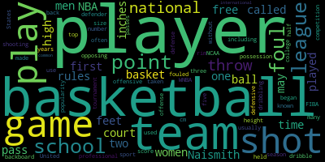
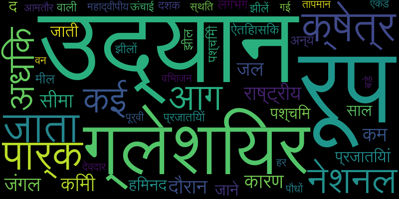

Made word clouds in English and Hindi using python. 
* Data scrapeed from Wikipedia using Beautiful soap.

* Tokenization , POS tagging , Removing stop-words, Stemming and Lemmatization done using NLTK.

* Matplotlib used to represent graphs.

English wordcloud:

Hindi wordcloud:

